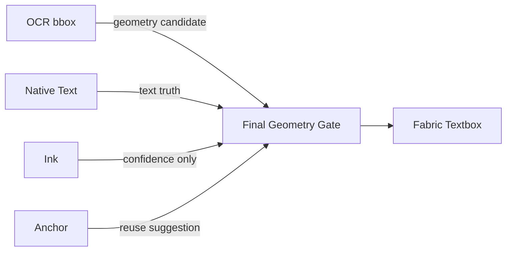

# STAGE9 几何权威审计（Geometry Authority Audit）

- 日期：2026-09-22
- 状态：只读审计（未改生产行为）；补充 STAGE9_GEOMETRY_REGRESSION_AUDIT.md 的「先 9.9 Closure，再修复」执行层
- 结论：当前系统**没有唯一几何权威**，四个回归源（墨迹接管 / 运行时漂移 / Anchor 复用 / Native Truth）不是并列问题，
  而是同一根因「多个 Truth Source 竞争」的分支表现。先闭环几何权威，再按 Commit A-E 修复。

## 1. 几何来源全链路（当前实现）

```mermaid
flowchart TB
  IMG[源图片] --> OCR[Baidu/Local OCR]
  OCR --> OCRBBOX[OCR bbox（识别/搜索区域）]
  OCRBBOX -->|Src A: 唯一目标几何（demo 模型）| MAP[mapRectToCanvas(imgT,aCoords)]
  INK[ImageInk 墨迹盒] -->|Src B: 4.6-A 接管 conf≥0.30| MAP
  MAP --> TQ[targetQuad]
  TQ --> SOLVE[Geometry Solver: c8L/c8T/c8W/c8H + fs]
  NATIVE[Native OCR textType=2] -->|Src C: 文字真值| SOLVE
  SOLVE --> ITEM[item {left,top,width,height,angle,fontSize,fontFamily,fill,text}]
  ITEM --> CREATE[page-bridge ocrCreate: cfg.left/top + drawText]
  CREATE --> MEASURE[创建后 measure + 校准]
  CALIB[runGeometryCalibration ≤8 轮] --> MEASURE
  MEASURE --> FINAL[Fabric Textbox 最终几何]
  ANCHORS[Native Anchors] -->|Src D: 复用建议| CREATE
  ANCHORS --> APPLY[applyAnchorStyleToObject 同步 left/top/…/text/fill]
  APPLY --> FINAL
```

竞争点：**OCR bbox / Ink box 同时喂 MAP**（无一致性裁决）；**SOLVE 输出 / 复用同步 / 创建后校准**都能改写 textbox 最终几何；**校准循环用字体测量反馈**，字体回退不同 → 输出漂移。

## 2. 字段写入清单（每个 geometry 字段 ← 哪些 source）

| textbox 字段 | 写入者（按执行顺序） | 备注 |
|--------------|----------------------|------|
| left / top | ① targetQuad→c8L/c8T（=OCR bbox 或 Ink box，见 L1888-1895）② Anchor 复用同步（applyAnchorStyleToObject）③ runGeometryCalibration 中心修正（≤8 轮，L2036+） | 三个 writer 无优先级门禁；末次写入=校准 |
| width | ① c8W（targetQuad）② text-fit/layout（防换行）③ 校准宽度修正 | 墨迹字号目标（resolveTypographyTarget）只影响 fontSize，不影响 width 源（宽度仍 bbox） |
| height | ① c8H（targetQuad）② 校准 | |
| angle | ① tqG.angle（targetQuad）② 校准双旋转核对 | |
| fontSize | ① fusion8d.solveFontSizeFusion（advance 宽度主 + ink 高度交叉 + gate）② 校准字号修正 | **不来自 bbox height**；字体回退→测量偏差→漂移 |
| fontFamily / fontWeight / fontStyle | Anchor 复用同步 or 编辑器默认（measureFamily） | 无独立 evidence 时回落 editor 默认 |
| lineHeight | layout 求解（多行） | |
| text | Native textType=2 rawText（真值，铁律）其余块 safeText | 打印体卡手写引擎错字 → 真值即错字 |
| fill | native-color shouldApplyFill 门禁 | 弱证据 skipped 保留原 fill |
| uuid/markuuid/zyOcrObjectId | 原生创建 identity（editor-object-identity）；Anchor 复用保留 | 每事务新 uuid（非确定性指标） |
| visualGeomSource | 诊断字段：IMAGE_INK / OCR_BBOX_FALLBACK | 只读 |

裁决缺口：left/top/width/height 有 3 个 writer、fontSize 有 2 个 writer，**均无「谁写后为准」的显式仲裁层**；
校准循环（后写）实际是最终权威，但它依赖字体测量，而字体测量受 font 加载影响 → 确定性前提不成立。

## 3. Determinism 实测（Stage 9.9，任务书验收项）

- harness：`runtime/stage9/det-n-run.js`（新增只读，不改生产代码）——同卡（real-card-xiazhu.png）子进程隔离连续运行
  commit-46-real.js（V0 × B=10 / A=3），聚合 targetGeometry/fontSize/fontFamily + OCR bbox 输入的 range/stdev。
- pass 容差：left/top/width/height ≤3px；angle ≤0.5°；fontSize ≤1px；（fontFamily 需跨 run 一致）。
- **结果：见 runtime/reports/stage-9/det-9.9/determinism-summary.json（审计后回填此处）**
- 判定口径：degradedFields 为空 → 几何求解确定性成立，方可进入 Commit C/D；否则先修确定性（Commit B 固化来源）。

## 4. 修复执行计划（Commit A-E，按序，禁用跨档合并）

### Commit A — 墨迹位置接管默认为「回归置信辅助」（不开位置）
- 关闭 vbBox 直接作为 target 映射源（INK 只保留：confidence / region candidate / background mask，供诊断与后续质量门禁）。
- 几何唯一权威 = OCR bbox → imgT → targetQuad（= demo 同模型）。
- 新增 `geometry-source audit log`：每 block 记录 {authority: "OCR_BBOX", candidateList, rejectionReason}（入 diag，只读）。
- 验收：同一卡 A/B（B 不再出现 IMAGE_INK 改写）dx 收敛 demo 水平（±10px）；29 单测 + full regression 通过。

### Commit B — Geometry Determinism harness（本审计已建 det-n-run.js；固化基线）
- N=10 同卡连续运行记录 uuid/x/y/width/height/angle/fontSize/fontFamily，variance≈0 才继续。
- 若检测到漂移 → 定位（画布 objectWidth/DPR aCoords 来源 / font fallback）并冻结来源。

### Commit C — Anchor matcher hardening（仅在 Commit B 确定性成立后）
- MATCH_THRESHOLD 0.55 → 提高（建议 ≥0.68）；新增：length penalty（2-4 字短串）、semantic penalty（同义/近义风险词）、geometry distance gate（候选锚与 target 距离超阈值直接拒绝）。
- 验收：短串（微信:/手机:/Mobile）无错配用例；重复创建防复发。

### Commit D — Native Truth promotion gate
- Native 文本降级为 `Truth Candidate`：需 Validation Gate（与 Baidu/Local 文本相似性 + 图片墨迹证据核对）通过才 Promote 入 textbox.text；
  不一致行仅诊断，不创建（沿用 partial-create / NATIVE_PARTIAL_OK 语义，不违 Native Truth 铁律）。
- 验收：打印体卡「里才师」类错字不再上画布；手写卡正确文本仍直达。

### Commit E — 重新开启墨迹辅助（仅辅助）
- 墨迹回归为 mask / confidence / region proposal 提供方（供质量门禁与后续字段校验）；禁止直接写 position/size/rotation。
- 验收：image-ink / color / font 门禁使用墨迹 confidence 全链路不回退。

## 5. 最终目标架构



- Geometry Gate 是唯一写出 position/size/rotation/text 的仲裁层；Ink/Anchor 只提供建议与置信度，永不直接落字段。

## 6. 未决项（阻断部分验收）

1. 用户卡（盈通启富）实测：墨迹接管在真实卡上的触发与偏移量（需用户提供卡图或 thirdDiyAdd.do URL）。
2. runner 的 anchorUsed 回填未生效（diag 采集后未回填）→ Commit C 前修复采集。
3. 字体回退（fallback vs real font）对测量的影响：Commit B 需增加 fontlist 冻结/探测。

## 7. 实测结论（2026-09-22，det-n-run harness：V0 × B=10 / A=3，子进程隔离）

证据文件：runtime/reports/stage-9/det-9.9/determinism-summary.json + det-run-{ab}-{i}.json（本审计入库）

### 7.1 Determinism（模式内）：variance ≈ 0 —— 「运行时漂移」假设被推翻

- 全部 13 次运行 exit=0、15 行、Native OCR 通过（保留 15 个）。
- target.left/top/width/height/angle、fontSize、ocrBBox 在 **B×10 内 range=0/stdev=0**，**A×3 内同样 range=0**。
- fontFamily 恒为 sans-serif。→ 同一模式下几何求解**完全确定**。
- 早先「同卡 A/B 两次 run target 漂 1.6~94px」的判断错误：那是**模式差异**（B 的 ink 接管），不是运行噪音。

### 7.2 模式分隔（Ink 接管开启 vs 关闭）：同输入 → 两类稳定几何

| block | ocrBBox.left(输入, 两模式相同) | A target.left(ink 关) | B target.left(ink 开) | Δleft |
|-------|--------------------------------|----------------------|----------------------|-------|
| 夏祝莲 | 187.03 | 187.03 | 248.66 | **+61.63** |
| 13719111188 | 356.91 | 356.91 | 394.42 | **+37.51** |
| 2287483098 | 357.98 | 357.98 | 452.30 | **+94.32** |
| Mobile | 311.36 | 311.36 | 312.97 | +1.61 |
| 微信: | 310.82 | 310.82 | 312.43 | +1.61 |

- fontSize（61/17/10/14）、fontFamily、target.width 两模式**完全一致** → 仅 left 被改写，纯平移。
- A 模式的 target==OCR bbox 输入（锁定：A 正确地把 OCR bbox 作为目标源）。

### 7.3 根因（证据 + 一个掩盖性诊断 bug）

1. **ink 接管真实触发且几何错误**：B 模式全部行 inkConfidence=1（≥0.30 门槛放行），
   但墨迹盒与文字行严重不符 —— 13719111188 inkBox=16×30（单字形碎片）、夏祝莲 inkBox=99×111（跨行大团块）、
   2287483098 inkBox=17×31。行/列投影对数字串、多字形混排挑错 span。
2. **无任何「墨迹盒 vs OCR bbox」一致性校验**：confidence 是墨迹算法自评（dominantRatio/rowBandConfidence 融合），
   对「region 是否真的就是该行文字」零外部验证 → 自评 1.0 的错误盒直接被当作 target 源。
3. **诊断掩盖**：userscript L1715 `const visualGeomSource = …` 是 `if(imgT)` 块内 const，
   diag 采集（L1859）在块外以 `typeof visualGeomSource !== "undefined"` 访问 → 恒为 undefined → 恒记为
   `OCR_BBOX_FALLBACK`。→ 此前「真机 15/15 全 FALLBACK、ink 未触发」的结论错误，掩盖了 ink 一直在线接管。

### 7.4 对执行计划的修正（确认用户排序）

- Commit A 优先级再次确认：**墨迹位置接管必须停止直写 position**；第一步包含两件诊断修正：
  a) 把 visualGeomSource/srcBox 提升到函数外层作用域（诊断如实上报 IMAGE_INK）；
  b) 几何唯一权威回退 OCR bbox → imgT → targetQuad（= demo 模型），ink 仅输出 confidence/region/mask。
- Commit B（determinism harness）已完成基线：det-n-run.js + N=10 口径固化；判定门槛（模式内 range≤3px/0.5°/1px）已用本数据验证可用。
- Commit E 重新开启墨迹辅助时，把 7.3-2 的「一致性校验」列为强制门禁（inkBox 与 bbox 目标差超阈值 → 拒绝，仅作信噪提示）。
